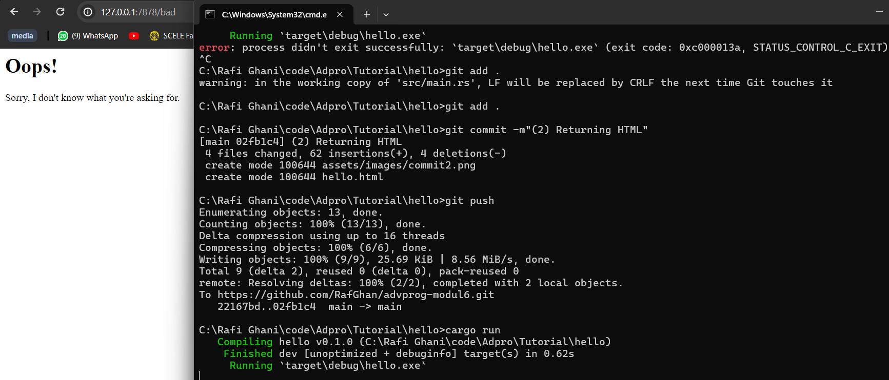

# TUTORIAL 6 ADPRO
### Rafi Ghani Harditama (2206081364)
### Advanced Programming A/VRO

#### COMMIT 1 REFLECTION NOTES

Yang dilakukan oleh fungsi `handle_connection`:
``` rust
fn handle_connection(mut stream: TcpStream) { 
    let buf_reader = BufReader::new(&mut stream);
    let http_request: Vec<_> = buf_reader
        .lines()
        .map(|result| result.unwrap())
        .take_while(|line| !line.is_empty())
        .collect();
    println!("Request: {:#?}", http_request);
}
```

* `handle connection` adalah fungsi yang bertanggung jawab untuk menangani koneksi TCP dari klien. Fungsi ini membaca permintaan HTTP dari klien yang terhubung dan mencetaknya ke konsol untuk keperluan pemeriksaan respons koneksi. 

* penjelasan per line:

``` rust
let buf_reader = BufReader::new(&mut stream);
``` 
Pada baris ini, sebuah `BufReader` baru dibuat dengan menggunakan `&mut stream`, yaitu referensi mutable ke TcpStream yang diberikan sebagai parameter fungsi `handle_connection`. 

``` rust
let http_request: Vec<_> = buf_reader
    .lines()
    .map(|result| result.unwrap())
    .take_while(|line| !line.is_empty())
    .collect();
```
Baris tersebut menginisialisasi `http_request` sebagai sebuah vector yang berisi data dari permintaan HTTP yang diterima dari klien. `buf_reader.lines()` digunakan untuk membaca setiap baris dari TcpStream. `map(|result| result.unwrap())` digunakan untuk mengkonversi hasil  yang awalnya berbentuk `Result` menjadi `String`.`take_while(|line| !line.is_empty())` digunakan untuk mengambil baris-baris sampai ditemukan baris kosong yang menandakan akhir dari permintaan HTTP. Dan `.collect()` digunakan untuk mengumpulkan baris-baris tersebut ke dalam bentuk vector

``` rust
println!("Request: {:#?}", http_request);
```

Baris ini mencetak `http_request` ke konsol. `{:#?}` digunakan untuk mencetak struktur data secara format dengan lebih mudah dibaca. 

#### COMMIT 2 REFLECTION NOTES


Tambahan kode pada fungsi `handle_connection` di `main.rs`:
```rust
    let status_line = "HTTP/1.1 200 OK";
    let contents = fs::read_to_string("hello.html").unwrap();
    let length = contents.len();

    let response =
        format!("{status_line}\r\nContent-Length: {length}\r\n\r\n{contents}");

    stream.write_all(response.as_bytes()).unwrap();
```

* penjelasan per line:
``` rust
 let status_line = "HTTP/1.1 200 OK";
```
Baris ini mendefinisikan status line yang akan dikirimkan sebagai bagian dari respons HTTP. Ini menunjukkan bahwa respons akan memiliki kode status 200, yang berarti "OK".

```rust
let contents = fs::read_to_string("hello.html").unwrap();
```
Baris ini membaca isi dari file `hello.html` dan menyimpannya dalam variabel `contents`

``` rust
    let response =
        format!("{status_line}\r\nContent-Length: {length}\r\n\r\n{contents}");
```

Baris ini menghitung panjang konten yang akan dikirimkan dalam respons HTTP. Baris ini membuat respons HTTP dengan menggabungkan status line, panjang konten, dan konten itu sendiri ke dalam satu string menggunakan format string. `\r\n` digunakan untuk menambahkan karakter newline yang diperlukan dalam spesifikasi HTTP.

``` rust
stream.write_all(response.as_bytes()).unwrap();
```
Baris ini menuliskan respons HTTP ke dalam stream sebagai bytes. 

#### COMMIT 3 REFLECTION NOTES

1. Membuat file `404.html` yang akan dikembalikan jika path tidak sesuai. isi dari `404.html` sebagai berikut:
``` rust
<html lang="en">
  <head>
    <meta charset="utf-8">
    <title>:&#40;</title>
  </head>
  <body>
    <h1>Oops!</h1>
    <p>Sorry, I don't know what you're asking for.</p>
  </body>
</html>
```

2. Pada `main.rs`, modifikasi fungsi `handle connection` menjadi seperti berikut:
```rust
fn handle_connection(mut stream: TcpStream) {
    let buf_reader = BufReader::new(&mut stream);
    let request_line = buf_reader.lines().next().unwrap().unwrap();

    if request_line == "GET / HTTP/1.1" {
        let status_line = "HTTP/1.1 200 OK";
        let contents = fs::read_to_string("hello.html").unwrap();
        let length = contents.len();

        let response = format!(
            "{status_line}\r\nContent-Length: {length}\r\n\r\n{contents}"
        );

        stream.write_all(response.as_bytes()).unwrap();
    } else {
        let status_line = "HTTP/1.1 404 NOT FOUND";
        let contents = fs::read_to_string("404.html").unwrap();
        let length = contents.len();

        let response = format!(
            "{status_line}\r\nContent-Length: {length}\r\n\r\n{contents}"
        );

        stream.write_all(response.as_bytes()).unwrap();
    }
}
```
Pada kode diatas, fungsi `handle_connection`membaca baris permintaan HTTP, dan memeriksa apakah itu permintaan `GET / HTTP/1.1`, menunjukkan permintaan untuk jalur root (/). Jika permintaan adalah untuk jalur root, fungsi memberikan respons dengan status `HTTP/1.1 200 OK`. Selanjutnya, ia membaca konten dari file `hello.html`, menghitung panjangnya, membuat respons HTTP yang berisi konten tersebut, dan mengirimkannya kembali ke klien. Namun, jika permintaan bukan untuk jalur root, menandakan bahwa sumber daya yang diminta tidak ditemukan, fungsi akan memberikan respons dengan status `HTTP/1.1 404 NOT FOUND`. Kemudian, ia membaca konten dari file `404.html`, menghitung panjangnya, membuat respons HTTP yang berisi konten tersebut, dan mengirimkannya kembali ke klien. 

Namun, setelah modifikasi, blok `if` dan `else` memiliki banyak repetisi karena keduanya sama-sama membaca dan menulis file ke stream. Perbedaan utamanya terletak pada status line dan nama file yang dibaca. Oleh karena itu, perlu dilakukan refactoring untuk mengatasi repetisi ini. sehingga fungsi `handle_connection` menjadi seperti berikut:

``` rust
fn handle_connection(mut stream: TcpStream) { 
    let buf_reader = BufReader::new(&mut stream);
    let request_line = buf_reader.lines().next().unwrap().unwrap();

    let (status_line, filename) = if request_line == "GET / HTTP/1.1" {
        ("HTTP/1.1 200 OK", "hello.html")
    } else {
        ("HTTP/1.1 404 NOT FOUND", "404.html")
    };

    let contents = fs::read_to_string(filename).unwrap();
    let length = contents.len();

    let response =
        format!("{status_line}\r\nContent-Length: {length}\r\n\r\n{contents}");

    stream.write_all(response.as_bytes()).unwrap();
}
```

3. Bukti bahwa sudah dapat menangani jika path tidak sesuai:


